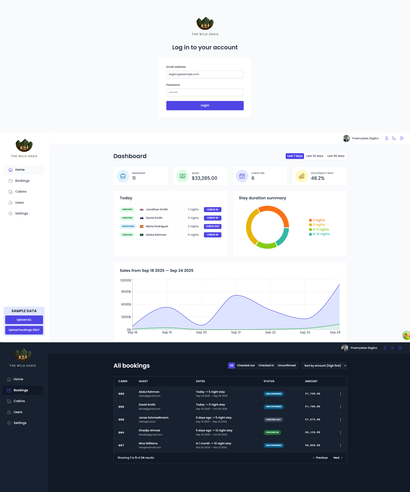

# <span align="center"><samp>The Wild Oasis</samp></span>

Internal back-office SPA for The Wild Oasis, a boutique hotel with 8 cabins. Staff authenticate and manage cabins, bookings and guests, run check-in/out workflows, and monitor occupancy, revenue and other KPIs from a live dashboard.

This project is based on [_The Ultimate React Course 2025: React, Next.js, Redux & More_](https://www.udemy.com/course/the-ultimate-react-course/) by Jonas Schmedtmann. Educational repository - not intended for production use.

## Demo



## Features

- Authentication: email + password, protected routes, role-gated actions
- Users: create new staff users from inside the app; update profile (name, avatar, password)
- Cabins: CRUD, price/discount, capacity, description, photo upload
- Bookings: list, filter by status/date, details view, edit meta (breakfast, observations), cancel
- Check-in / Check-out: mark arrivals/departures, optional breakfast upsell, payment capture flag
- Guests: automatic creation from booking data, search by name/email
- Dashboard: today’s stats, occupancy rate, upcoming stays, revenue, stay duration, charts
- Settings: global defaults (breakfast price, min/max nights, max guests per booking)
- Notifications: success/error toasts, optimistic UI where safe
- Forms: validation, error messages, disabled states, submission spinners
- Remote data: caching, refetch on focus, pagination/prefetching where applicable

## Tech Stack

- **React 18** + **Vite 4**
- **React Router v6.4+** – routing, loaders/actions
- **React Query** – remote state / caching
- **styled-components** – styling & theming
- **React Hook Form** – forms & validation
- **Supabase** – database, auth, storage
- **Recharts** — charts in dashboard

## Pages

- `/login` – staff login
- `/dashboard` – KPIs, charts
- `/cabins` – cabins management
- `/bookings` – bookings list
- `/bookings/:id` – booking details
- `/checkin/:id` – check-in flow
- `/settings` – global hotel settings
- `/users` – create new user
- `/account` – update profile

## Project structure

```bash
src/
├─ data/               # seed/mock data
├─ features/
│  ├─ authentication/  # login, protected route, new user form
│  ├─ bookings/        # list, detail, filters
│  ├─ cabins/          # table, form, image upload
│  ├─ check-in-out/    # check-in/out flows
│  ├─ dashboard/       # widgets, charts
│  └─ settings/        # global defaults
├─ pages/              # route components wiring features
├─ services/           # supabase client, API wrappers
├─ hooks/              # reusable hooks (useOutsideClick, useMoveBack, etc.)
├─ context/            # app-wide context with dark mode
├─ ui/                 # buttons, inputs, modals, tables, spinner, toast provider
├─ styles/             # theme, GlobalStyle, styled-tools
├─ utils/              # formatCurrency, formatDate, calc helpers
├─ main.jsx
└─ App.jsx
```

## Installation

```bash
# 1. Clone
git clone https://github.com/zeglicz/the-wild-oasis.git
cd the-wild-oasis

# 2. Install
npm install

# 3. Env
cp .env.example .env   # or create .env and fill values

# 4. Dev
npm run dev

# 5. Build / Preview
npm run build
npm run preview
```
